# PROYECTO RED SOCIAL

## **INTRODUCCIÓN**
***

El producto socilitado por la cliente es una red social, de las opciones temáticas para desarrollar el producto escogimos realizar una red social de alimentación, nos enfocaremos principalmente en conocer la experiencia de las personas en los lugares a los que suelen acudir cuando tienen antojitos.

El nombre elegido es [Wari ¿qué?](https://www.figma.com/proto/RZ0tWEcYIf6hfsMQWWf1dQmA/Social-Neetwork?node-id=19%3A2&scaling=scale-down) porque los wariques son lugares escondidos donde se suele comer rico y se llega por recomendaciones, además tomamos en cuenta la siguiente definición:

> "La palabra huarique (o warique) es un vocablo quechua que proviene de dos palabras, la primera es 'wa', la cual era utilizada para referirse a algo que no se entiende, que no se conoce o que esta escondido. La segunda palabra es 'rique', la cual deriva de la palabra 'rocqro' que significa guiso. Haciendo el ejercicio de unirlas se podría decir que warique es un lugar escondido donde se hacen guisos. 
(Fuente: Martha Hildebrant). 

> Es por eso que muchos conocedores del buen comer (llamados también sibaritas y gastrónomos) han venido usando el término huarique. Ahora se entiende el porque son lugares poco conocidos pero donde comer es una experiencia única.Cabe recalcar que la mayoría de huariques tienen fama de ser económicos. En la mayoría de casos esto se aplica pero en otros el precio esta a la par de los más reconocidos restaurantes gourmets. Paga el que sabe comer. "
Fuente: [yumi.pe](http://www.yumi.pe/que-significa-huarique/)

## **PLANIFICACIÓN** 
***

En este proyecto utilizamos descripciones de los ítems del backlog del producto como "historias de usuario" para organizar el trabajo en función del valor que se le aporta al usuario.

En laboratoria, la metodología de trabajo es realizada en squads ( grupos de 6 a 7 personas), con las que puedes dar y recibir feedback constante de tu proyecto.
Debido a que el proyecto fue realizado por un equipo de dos o tres personas , se vio por conveniente utilizar el tablero trello, herramienta necesaria para un seguimiento virtual del progreso.

| **Sprint** | **Tablero Kanban por equipo en trello** | 
| :------- | :------: | 
| Del primero al tercero  | 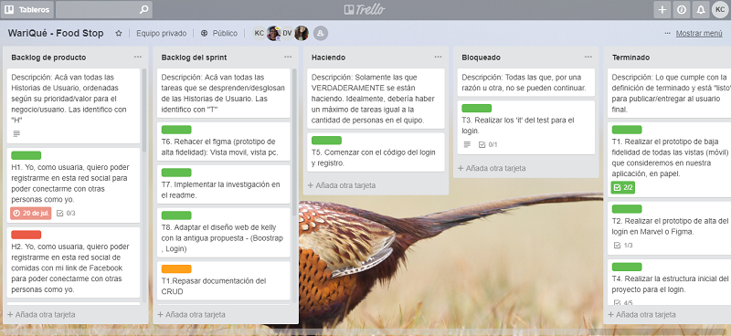 | 

## **USER EXPERIENCE**
***

La experiencia del usuario la hemos trabajado según las 5 fases del proceso de diseño de design thinking:

### **2.1. DESCUBRIMIENTO E INVESTIGACIÓN** 
 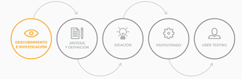

En esta etapa la parte más importante es la de investigar y entender a nuestros principales usuarios.

En una rápida investigación, se extrajo diferentes puntos de vista acerca del tema de la alimentación constituyente a la cocina tradicional .

>**Hábitos del consumidor**
Según una encuesta realizada a consumidores de alimentos, con características de vida comparables, se pudieron establecer importantes parámetros: 
Dedicación de menor tiempo a la compra y a la elaboración de los alimentos.
En la misma línea, se producirá una tendencia al plato único, o en todo caso, a comidas menos estructuradas.  
Tendencia generalizada a hacer dietas periódicamente por razones estéticas y de salud.
Fuente: Estudio sobre tendencia de consumo de alimentos.

>La cocina tradicional regional constituye un patrimonio construido social e históricamente. Se trata de un acervo que se ha ido enriqueciendo y modificando generacionalmente y que se ha recreado y transformado localmente. Padilla expone que: 
Las cocinas constituyen un elemento de sinergia sobre diversos aspectos de la vida de las comunidades: la agricultura, la dieta, los mercados tradicionales, las formas de conservar los alimentos, las tradiciones, los procedimientos desde las viejas tecnologías hasta las innovaciones más recientes. Así como también las cocinas están al centro de procesos de intercambios culturales regionales que van conformando las identidades en el ir y venir de sus pobladores. Fuente: La cocina tradicional regional como un elemento de identidad y desarrollo local (Padilla, 2006:2)

>Hoy día, la disponibilidad de alimentos elaborados, las redes de distribución de los productos frescos, el precio de los alimentos, ponen a disposición de todas las mesas un número de productos alimentarios enorme, muchas veces ya elaborados, que complican enormemente la selección y la combinación saludable de los alimentos. Si a esto unimos que nuestra sociedad se ha mecanizado por completo, tenemos como resultado una nueva dificultad para mantenernos sanos. Fuente: Alimentación saludable, guía para las familias

**Encuesta**

### **2.2 SINTESIS Y DEFINICION**
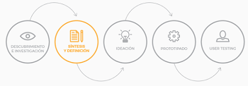

En esta fase usamos los datos coleccionados y entendemos los deseos y necesidades del público al que estará dirigido nuestro producto.

//añadir comntario

### **2.3 IDEACIÓN**
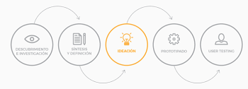

En esta fase buscamos las mejores maneras para ejecutar/desarrollar las funcionalidades definidas en la fase de ideación. Para esto hacemos un bechmarking de las principales redes sociales como análisis de competencias:

**Benchmark de las principales redes sociales**

**Sección de Gastronomía de [El Comercio](https://elcomercio.pe/noticias/gastronomia)**

En esta sección realizan galerías de sitios donde podemos ir a comer un determinado platillo, visitar en una ruta, eventos gastronómicos.
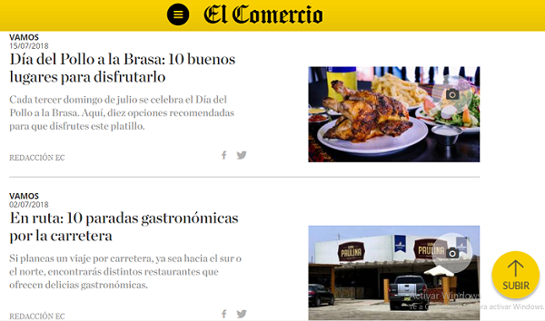

### **[El Trinche](http://www.eltrinche.com/)**

Es una plataforma web que recomienda restaurantes, tiene blogeros colaboradores.

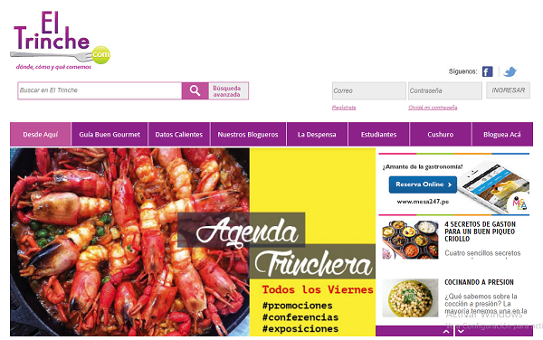

**Yelp**

Es otra gran alternativa para encontrar cualquier tipo de negocio, pero sobretodo para restaurantes y bares. Su buscador nos permite filtrar los resultados por precio, si están abiertos en este momento, si aceptan reservas, si tienen alguna promoción vigente y por características. Además, permite ordenar los resultados por valoración o distancia, y ver los resultados en el mapa. (Fuente:www.xatakandroid.com)

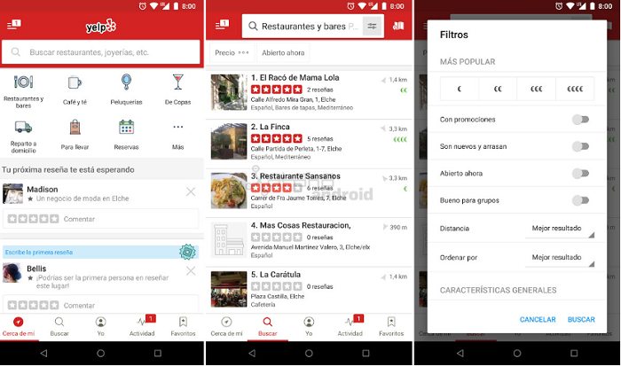

**Foursquare**

Es una de las aplicaciones más conocidas para encontrar sitios para comer, ir de compras o de fiesta, también con una gran comunidad de usuarios detrás dejando valoraciones. Su buscador cuenta con numerosos filtros, nos deja ver los resultados en el mapa y diferentes secciones para localizar los restaurantes de un tipo de comida o servicio (Fuente:www.xatakandroid.com)

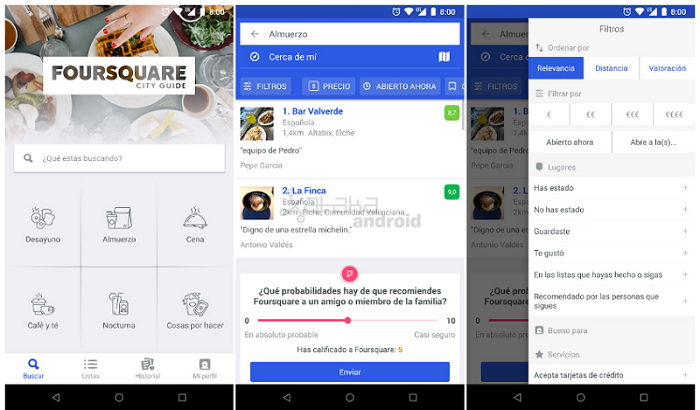

**Google Maps**

Con Google Maps podemos filtrar los resultados por valoración para ver solo los mejores sitios en el mapa.
Dentro de su buscador encontramos sección Explorar, así encontraremos diferentes selecciones para ir a comer, merendar, cenar, etc... mostrando los sitios más populares para cada momento del día. En cada ficha de un restaurante veremos su información, fotos, horas populares y reseñas. (Fuente:www.xatakandroid.com)

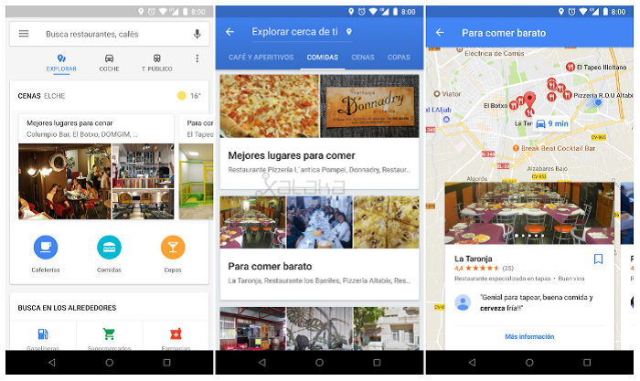

### **2.4 PROTOTIPADO**
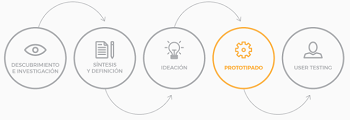

En esta etapa elaboramos un prototipo que nos permita probar nuestras ideas con usuarios para saber si estamos resolviendo satisfactoriamente sus necesidades con nuestro producto.

**Prototipado de baja fidelidad**

  El prototipo de baja fidelidad realizado por el equipo de acuerdo al diseño.

| **Vista login** |
| :-------:        |       
| 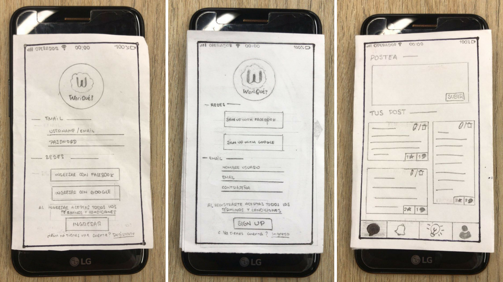| 

|**Vista registro** | |
| :------  |       -----: |
| | |

**Prototipado de alta fidelidad**

El prototipo de alta fidelidad se realizó en [Figma](https://www.figma.com/file/RZ0tWEcYIf6hfsMQWWf1dQmA/Social-Network?node-id=9%3A1) donde elaboramos las vistas a considerar para la presentacion del proyecto.

**Vista movil**

|**Login** | **Registro**| **Muro de publicaciones**|
| :------  |   :-----: |  -----:|
|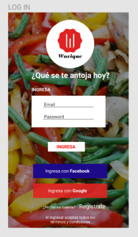 | 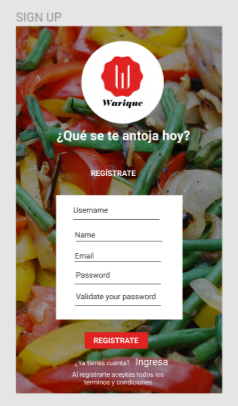| 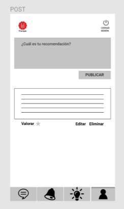|

**Vista en web** 

|**Login** | **Registro**| **Muro de publicaciones**|
| :------  |   :-----: |  -----:|
|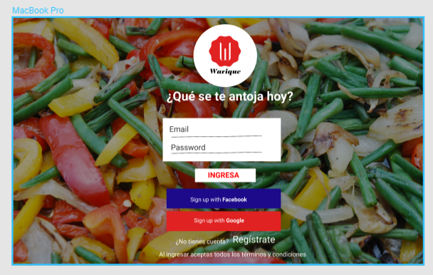 | 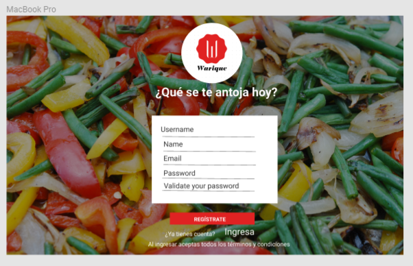| |

 #### **2.5 TESTEO CON USUARIOS**

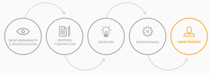

  **Feedback**

   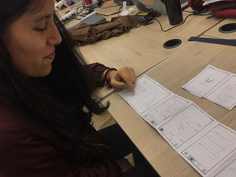

  
* Como primer feedback de testeo, el usuario comentó que si crea una cuenta nueva entonces debe ser redirigido a la web automáticamente y no a la página de acceso porque crearía demasiada redundancia.

* Como segundo feedback de testeo, el usuario comentó que las letras de "crear cuenta" e "iniciar sesión" deben ser más vistosas pues le era confuso diferenciar su funcionalidad. 

* Como tercer feedback de testeo, el usuario comentó que la primera vista creada que solo contenía dos botones, es innecesaria y que debía haber una vista de registro y otra vista de login.

* Como cuarto feedback de testeo, el usuario comentó que la web de posts debe tener un orden vertical para tener un orden.

Luego de completar el proceso de diseño de experiencia del usuario, logramos responder a los requerimientos del proyecto planteados por Laboratoria.

## **DEFINICIÓN DEL PRODUCTO**
***

**Cuáles son los elementos básicos que tiene una red social.**

Los elementos básicos que estamos considerando son:
- Registro
- Login
- Muro de publicaciones

**Quiénes son los principales usuarios de producto.**

Nuestros principales usuarios son:
- Parejas que buscan un lugar nuevo para comer.
- Familias que buscan almorzar algo diferente y rico, un fin de semana.
- Personas que constantemente buscan probar nuevos sabores.

**Cómo descubriste las necesidades de los usuarios.**

A través de entrevistas, se le preguntó a los usuarios lo siguiente:
- Cuando se te antoja algo en específico ¿tienes un lugar a donde ir?
- En caso no tengas un lugar, ¿dónde buscas recomendaciones?
- Si algún amigo o conocido te recomienda un lugar para ir a comer, por ejemplo, chicharrones o ceviche, irías solo en busca del lugar.
- Si conoces un buen lugar para comer, ¿lo recomendarías?

**Qué problema resuelve el producto para estos usuarios.**

Las personas siempre estamos buscando un buen lugar para comer, ya sea para invitar a la familia o por un simple antojo, pero muchas veces no sabemos a dónde ir. Con esta red social permitiremos que las personas puedan expresarse y recomendar los wariques y restaurantes que visiten a través de publicaciones personales y/o valorando las publicaciones de los demás usuarios.

**Cuáles son los objetivos de estos usuarios en relación con el producto.**

El principal objetivo es compartir información de dónde sirven los 'mejores' platos.

**Cuáles son las principales funcionalidades del producto y cuál es su prioridad.**

La prioridad del producto es recomendar platos de comida en lugares específicos. En la aplicación se podrá buscar por platos de comida y filtrar por distritos y precios.

**Cómo verificaste que el producto les está resolviendo sus problemas.**

A través de las entrevistas nos dimos cuenta de que las personas confían mucho en las recomendaciones de los demás sobre nuevos lugares para comer bien, pero no suelen encontrar con facilidad y en un solo lugar la información que necesitan.

**Cómo te asegurarás que estos usuarios usen este producto.**

La estrategia de difusión consiste principalmente en la recomendación 'boca a boca'. Además nos contactaremos con redactores de medios en línea de la sección tecnología y/o gastronomía, influencers y bloggueros para que realicen alguna mención de nuestra app en sus medios.

Adicionalmente realizaremos una campa de difusión en redes sociales (Twitter, Facebook e Instagram), con mayor fuerza en la hora de las comidas y fines de semana que es donde las personas se dan tiempo para buscar lugares para comer.

## **REQUERIMIENTOS DEL PROYECTO**
***

### Checklist

### General

* [ ] Producto final sigue los lineamientos del diseño.

### `README.md`

* [x] Definición del producto:
  * [x] Cuáles son los elementos básicos que tiene una red social.
  * [x] Quiénes son los principales usuarios de producto.
  * [x] Cómo descubriste las necesidades de los usuarios.
  * [x] Qué problema resuelve el producto para estos usuarios.
  * [x] Cuáles son los objetivos de estos usuarios en relación con el producto.
  * [x] Cuáles son las principales funcionalidades del producto y cuál es su prioridad.
  * [x] Cómo verificaste que el producto les está resolviendo sus problemas.
  * [x] Cómo te asegurarás que estos usuarios usen este producto.
* [x] Benchmark de las principales redes sociales.
* [ ] Resumen de entrevistas con usuarios.
* [x] Link/screenshots del prototipo de alta fidelidad.
* [ ] Conclusiones de testing con el prototipo de alta fidelidad con usuarios.
* [ ] Conclusiones de testing con el producto en HTML.

### Pruebas / tests

* [ ] Tests unitarios cubren un mínimo del 70% de statements, functions, lines y branches.
* [ ] Pasa tests (y linters) (`npm test`).

### Creación de cuenta (sign up)

* [x] Permite crear cuenta.
* [x] Valida email.
* [x] Valida password.
* [x] Muestra mensajes de error.

### Inicio de sesión (sign in)

* [x] Permite iniciar sesión.
* [x] Valida email.
* [x] Valida password.
* [x] Muestra mensajes de error.

### Muro (wall/feed)

* [x] Muestra _muro_.
* [x] Permite publicar nuevos posts.
* [x] Permite eliminar posts.
* [ ] Pide confirmación antes de borrar posts.
* [ ] Permite editar posts (in place).
* [ ] Permite publicar y filtrar posts por público/yo.
* [ ] Permite dar _like_ a los posts y llevar un conteo de ellos.

==================================================

